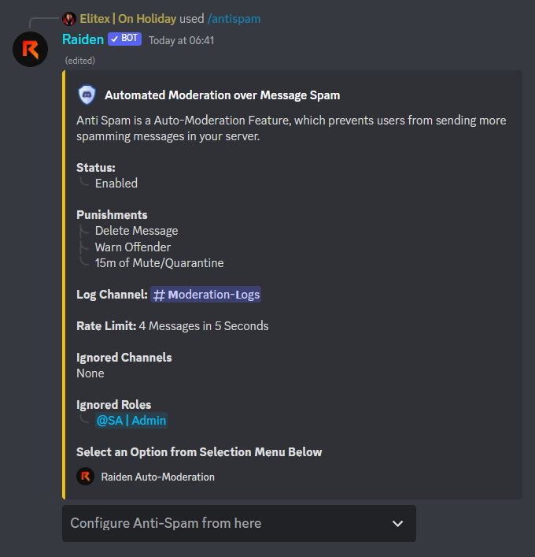
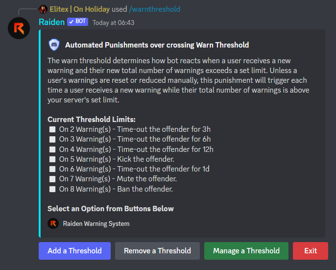

# Pre v4.5

Hey,\
\
We are glad to inform you, Raiden Version **Pre v4.5** is now Live. Bot is fully upgraded to provide you the best experience. There is a lot to say, but I am telling in a short here. You can have a look at _Changelog_ below.\
\
Currently bot is not having any Message Command except `ping` and `msg` command. Some most used commands like info's and moderation commands will arrive in Message Format soon \[before v4.5].\
\
Bot has been completely re programmed and will provide seamless experience from now. Most of the commands are now **Panel Based** rather than multiple command based\
\
Embed Builder will now support Custom Webhook options, over Sending and Editing. Help Command is completely changed and many more changes.

## Slash Commands

We have shifted all message commands to slash commands. Slash Commands are way more handy way to command the bot without worrying about the syntax itself.

## Lock and Unlock Channel

We have adapted a new way of locking and unlocking a channel. On using the `/lock` command, bot will edit the channel permission, in such a way that it will only allow Owner and Administrators to talk in the channel.


What about the permissions which bot removed? Do not worry about them, whenever the channel is unlocked by using Raiden itself. All permissions will be restored to its place.


## Auto Moderation

It's where our main UI change relies. We have not only shifted the message commands to slash commands, but we have also removed all sub-commands in the module \[i.e., `+antispam enable`].

We have developed the panel interface which will allow you to perform multiple changes by running just one command.&#x20;

&#x20;                                                   

## Warn Thresholds

Raiden can now give punishments to those who crosses certain warn limits. There can be multiple warn limits with different or same punishments.

&#x20;                                                  

## Temporary Muting, Mute Role and Quarantine

Raiden is programmed to remove each and every role from the user before muting them and grants them the mute role. You can configure mute role and its permission according to your needs.

After a long break, temporary mute is back. Temporary Muting is also integrated with all auto moderation modules.

If you don't give any permission to mute role and `@everyone` role, then the offender will be quarantined from the server, unless they are unmuted back.

## Help menu

We have upgraded interface of our help command. Help command is programmed to provide a brief use case of the Bot and give mini documentation on the bot and its service.

Help command is having following topics:

* Command List
* Mini Guide or Documentation
* Starting Setup / Setting
* Troubleshooting and common problems
* Quick Links

&#x20;                                                   

## Moderation Logs

Raiden logs each and every action carried out using it. Either it's a warning or a ban, Raiden logs each and every thing in a channel defined by you. Raiden uses Webhooks to log things up. So, make sure to give `Manage Webhook` permission to Raiden in your server and the Log Channel.&#x20;

&#x20;        .png>).png>)

## New Verification System

Give newly joined members a prompt to solve a basic math problem and get access to your server. Features of this verification system are:

* Multiple Role Support
* Can add/remove roles
* Button Interface
* Editable Embed
* Secures your server to some extent

Entire Verification system can be configured by using `/verification` in a channel. You are not required to run this command multiple times to setup various things in it. Just run the command once, use the advanced prompt and boom!

&#x20;                                                .png>)

## New Auto Role System

New auto role system supports adding and removing of multiple roles from newly joined member. Auto role also supports a time delay option, which means you can make the bot to give/remove any role after waiting for the provided period of time.

Example use case:\
Every user who joins your server, gets a newie role after 15 mins of joining and after 7 days of staying, the newbie role gets removed.


You can make an awesome auto role combination by using Verification and Auto Role system together.


Entire Auto role system can be configured by using `/autorole` in a channel. You are not required to run this command multiple times to setup various things in it. Just run the command once, use the advanced prompt and boom!

&#x20;                                                .png>)

## Logging

Raiden logs some of the server events as well. Raiden creates logs using Webhooks, so make sure to grant `Manage Webhook` Permission to the bot inside the log channel.

Following server events can be logged using Raiden:

* Member Join
* Member Leave
* Moderation
* Message Delete
* Message Edit
* Ghost Pings


More server events will be added soon to the logging system.


## Ticket System

Raiden ticket system offers advanced ticket functionality. It provides you a ticket panel, with a **Create Ticket** button. Whenever a user clicks the button, they are prompted to tell the reason of their ticket creation.

Ticket System offers following features:

* Create Tickets inside a provided category
* Move Closed Tickets to another category
* Make a Ticket Transcript and log them in a particular channel, for later use.
* Transcripts are of `.txt` format, which are readable from Discord itself
* Custom Ticket Management Roles

## New Welcomer System

All new welcomer system comes with a custom editor to customize your welcome message. A separate welcome message can now be sent to DMs as well.&#x20;

Welcome Card supports 25+ Fonts, Custom Background, Custom Text. Welcome Card can also be embedded inside a custom embed, with entries of your choice.

You can design the welcomer, whatever way you want, and you like. For example, in our Support Server, we use the same module as shown in image below

&#x20;                                                 .png>)

### Deprecations

Here is the list of deprecations which comes with new update

* Previously used Verification System is now deprecated
* Previously used Auto Roles are now deprecated
* Some punishments in Auto Moderation are deprecated
* Message Commands have been removed.

### Anything else?

* Well, we have a lot of updates coming soon.
* **Special thanks to the Bug Hunters and our beta testers for their lovely help.**
